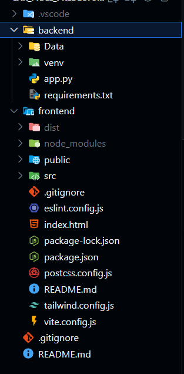

# 🚗 Car Price Predictor — React + Flask (AI Project)

This is a **Car Price Prediction Web App** that uses **Machine Learning (Linear Regression)** to predict the price of a car based on its features.  
The main goal of this project is to learn **how to build and deploy a full production-ready AI model** with a proper **frontend, backend, and machine learning integration**.

---

## 🖥️ Project Overview

The web app allows users to input car details like:
- Company name  
- Car name  
- Year of manufacture  
- Kilometers driven  
- Fuel type  

After submitting, it predicts the **estimated price** of the car using a trained ML model.

---

## 🌐 Preview

### Web Interface
Here’s how the website looks 👇  

*(You can replace this image name with your actual image file — for example, the screenshot you uploaded.)*

---

## ⚙️ Tech Stack

**Frontend:** React  
**Backend:** Flask (Python)  
**Machine Learning Model:** Linear Regression (Scikit-learn)  
**Styling:** CSS  
**Model Deployment:** Flask API  

---

## 📂 Folder Structure

---

## 🧠 How It Works

1. **Model Training:**  
   A Linear Regression model is trained using car dataset features such as year, company, model name, kilometers driven, and fuel type.

2. **Backend (Flask):**  
   The trained model is saved using `pickle` and loaded in Flask to make predictions through an API endpoint (`/predict`).

3. **Frontend (React):**  
   The frontend collects user input and sends it to the Flask API. It then displays the predicted price on the screen.

---

## 🚀 Running the Project Locally

### 1️⃣ Clone the Repository

git clone https://github.com/kmrzakir/car_price_predector
cd car-price-predictor

## 2️⃣ Setup the Backend (Flask)

cd backend
python -m venv venv
source venv/bin/activate     # On Windows: venv\Scripts\activate
pip install -r requirements.txt
python app.py

## 3️⃣ Setup the Frontend (React)

cd frontend
npm install
npm start

## 📡 API Endpoint

POST /predict

## 📸 Example Input Form

The app UI contains the following inputs:

Select Company Name (dropdown)

Select Car Name (dropdown)

Select Year (input box)

Kms Driven (input box)

Select Fuel Type (dropdown)

Submit Button (to get predicted price)

## 💡 Future Improvements

Add more ML models (RandomForest, XGBoost)

Improve UI with better design

Add authentication system

Deploy the model using Docker or cloud (DigitalOcean / Render)

## 🧑‍💻 Author

Developed by: Zakir
📍 India, Kashmir
